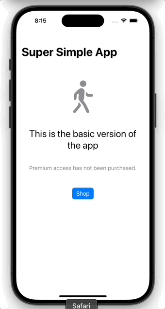

# Super Simple In-App Purchase Demo

## Overview

This app aims to demonstrate a minimal setup for an in-app purchase, using the most up-to-date available tools at time of writing. Namely:
- StoreKit 2
- SwiftUI
- Observability framework
- iOS 17+ StoreKit views (ProductView, StoreView or SubscriptionStoreView)

I've assumed the following requirements:
- A single, non-consumable in-app purchase. Typically this would be used for unlocking a premium feature.
- Must cater for [Strong Customer Authentication (SCA)](https://developer.apple.com/support/sca/) or [Ask to Buy](https://support.apple.com/en-us/105055).
- Must work online and offline.
- Must handle purchases that took place on another device.
- Must compile under Swift 6 language mode with default MainActor-isolation enabled.

## Why did I make this?

As I've been learning StoreKit 2, I've tried to create a sample app that demonstrates the best practices as I understand them.

While Apple's Backyard Birds sample code is comprehensive, it contains a lot more than I need and is rather overwhelming. 

Other examples that I've read are typically out-of-date or incomplete in some aspect. For example, they may be using StoreKit views but not the new observability framework. Or they may demonstrate handling a purchase, but not how to check for existing purchases on app start-up.

This demo app is intended to fill these gaps, document my learnings and serve as a quick reference. I want it to be a minimal, end-to-end, working example.

As this topic and my understanding of it continue to evolve, I have no doubt that this repository will soon also be out-of-date and/or incomplete. 🙂

## Running the app

The app uses a StoreKit configuration file for local testing.

- Click the scheme and choose Edit Scheme.
- Go to the Options tab.
- For StoreKit Configuration, select SuperSimpleInAppPurchaseConfig.storekit.

Now the app is ready to run on simulator or device.

## References

https://developer.apple.com/documentation/swiftui/backyard-birds-sample
https://developer.apple.com/documentation/storekit/in-app_purchase/implementing_a_store_in_your_app_using_the_storekit_api
https://github.com/RevenueCat/storekit2-demo-app
https://swiftwithmajid.com/2023/08/01/mastering-storekit2/
https://www.hackingwithswift.com/quick-start/swiftui/how-to-add-in-app-purchases-in-swiftui
